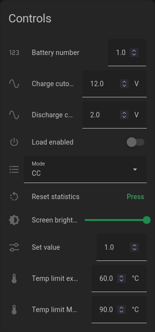
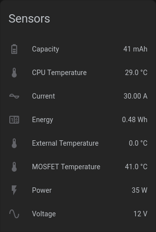
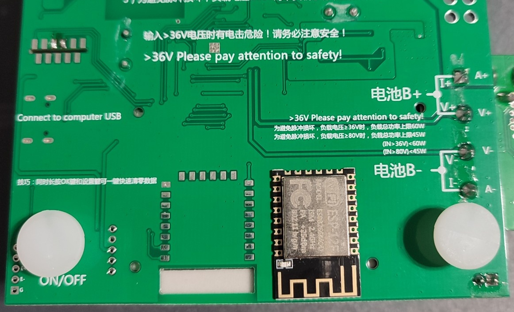
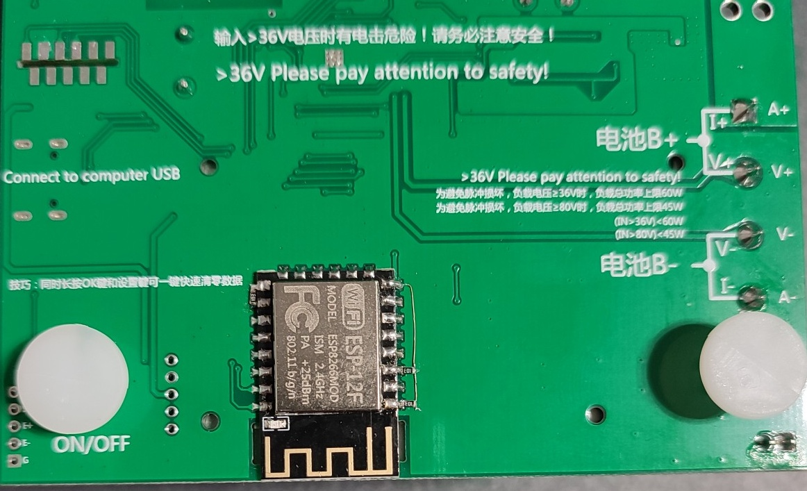

# Atorch Tuya ESPHome

Instructions and examples on how to convert Tuya enabled electronic loads from Atorch to ESPHome for local control with HomeAssistant.




## Supported devices
- Atorch BW150 (see [Extra steps for Atorch BW1504](#extra-steps-for-atorch-bw150))
- Atorch DL24/DL24P (see [Extra steps for Atorch DL24](#extra-steps-for-atorch-dl24))
- *other models with Tuya integration need to be tested*

## Installation
- Complete extra steps for your model if necessary
- Flash the ESP8266-12F module with ESPHome as described in [Flashing ESPHome](#flashing-esphome)
- Locate the ESP8266 footprint and solder on the module
  
  
- Add additional necessary components \
  Since the footprint isn't actually made for an ESP8266-12F, but for a Tuya WiFi module, there are some connections missing:
  - RST to VCC preferably via 10k
  - ENABLE to VCC preferably via 10k
  - GPIO15 to GND preferably via 10k
- Turn on the device and wait for the blue WiFi symbol to appear in the upper right corner of the screen

## Flashing ESPHome
First we need to prepare the ESPHome software and flash the ESP8266-12F. This can likely not be done in circuit since the serial lines are hardwired to the electronic loads CPU.
```sh
# Install esphome
pip3 install esphome

# Clone this external component
git clone https://github.com/1RandomDev/atorch-bw150-esphome.git
cd atorch-bw150-esphome

# Copy example config
cp secrets.yaml.sample secrets.yaml

# Validate configuration and upload code
esphome run atorch-bw150-esphome.yaml
```

Before soldering the module, verify that it's connected to your WiFi and you're able to upload OTA updates.

## Extra steps for Atorch DL24
> [!IMPORTANT]
> Only the new variant can be upgraded, see [Pictures](images/atorch-dl24-new-variant.jpg) for comparison.

The default firmware of the DL24 doesn't include WiFi support; therefore, we first need to flash the improved firmware of the BW150, which uses identical hardware.

The BW150 desktop app and firmware can be found [here](http://en.atorch.cn/NewsDetail.aspx?ID=84). After downloading the files, follow the firmware update instructions in the app. If the DL24 is not recognized, check if you have the new hardware variant.

## Extra steps for Atorch BW150
The existing Tuya based WiFi module (small standing PCB next to the buzzer) needs to be removed before continuing with the conversion. With small modifications to the script the original module can also be reused instead of an ESP8266.

## List of discovered Tuya data points
If you have an idea what DP 115 and 120 are used for, feel free to open an issue.

DP&nbsp;Id | Type | Description | Prescaler | Writable
-- | -- | -- | -- | --
101 | Integer | Cur voltage (V) | / 100 |
102 | Integer | Cur current (A) | / 1000 |
103 | Integer | Cur power (W) | / 100 |
104 | Boolean | Load ON/OFF |  | X
105 | Integer | Capacity (mAh) |  | 
106 | Integer | Energy (Wh) | * 100 |
107 | Integer | Screen brightness 1-9, not readable | | X
108 | Enum | Operating mode 0-8. Starting with CC, same order as in the main menu. |  | X
109 | Integer | Set value (dependent on operating mode) | / 100 | X
110 | Integer | Limit time (h), *conversion needs further testing* | / 100 | X
111 | Integer | Charge cutoff voltage (V) | / 100 | X
112 | Integer | Discharge cutoff voltage (V) | / 100| X
113 | Integer | CPU temperature (°C) | / 10 | 
114 | Integer | MOSFET temperature (°C) | / 10 | 
116 | Enum | Selected battery number | + 1 | X
115 | | *unknown, probably not readable* | | X
117 | Integer | Temp limit ext. sensor (°C) |  | X
118 | Integer | External sensor temperature (°C) |  | 
119 | Boolean | Clear capacity and energy measurements | | X
120 | Integer | *unknown* |  | X
121 | Integer | Temp limit MOSFET (°C) |  | X
